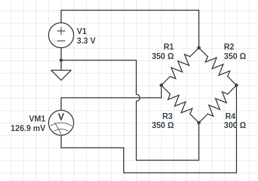

# Construcción del hardware

## Cómo empezar

He visto y pensado innumerable opciones de consttrucción de hard, utilizando varios componentes, conversores, ascelerometros, etc.
Hay un proyecto en el que me basado llamado [powerino](https://github.com/rrrlasse/powerino) que es muy detallista e interesante.

Mi propuesta es mejorarlo utilizando solamente el esp32

* [ESP32-WROOM-32D](https://es.aliexpress.com/item/4000103411061.html?spm=a2g0o.productlist.0.0.111c1796TpnMZb&s=p&algo_pvid=b5b269ca-6f40-413c-9ec6-bbd437c9cd5a&algo_expid=b5b269ca-6f40-413c-9ec6-bbd437c9cd5a-0&btsid=3624a1e4-1cb6-4926-98b2-61e037c8fa44&ws_ab_test=searchweb0_0,searchweb201602_9,searchweb201603_55) precio: ~ €5
* 10 x [Galga-BF350](https://es.aliexpress.com/item/32670476425.html?spm=a2g0o.productlist.0.0.34e7e59f3WxDTJ&algo_pvid=cba8f9d2-c895-4d9a-9a95-a41a78ec0af6&algo_expid=cba8f9d2-c895-4d9a-9a95-a41a78ec0af6-36&btsid=2d0ce2cc-7926-4f4c-a861-7e12dac8c8c3&ws_ab_test=searchweb0_0,searchweb201602_9,searchweb201603_55) precio: ~ €3,50 (hay unas que vienen soldadas, pero son un poco mas caras)
* [Resistencias](https://es.aliexpress.com/item/33015284007.html?spm=a2g0o.productlist.0.0.40295ca6tn5eB5&s=p&algo_pvid=78014ea3-bcbd-44f6-ae60-5c6087f01825&algo_expid=78014ea3-bcbd-44f6-ae60-5c6087f01825-3&btsid=440fccef-1869-40d6-b35f-bf8f33a9c039&ws_ab_test=searchweb0_0,searchweb201602_9,searchweb201603_55) precio: ~ €3
* [MPU-6050 (accel & gyro)](https://es.aliexpress.com/item/32944661306.html?spm=a2g0o.cart.0.0.15813c000oKAZ7&mp=1) precio: ~ €1,5

Por que utilizar solo el esp32, pues porque ya tiene casi todo lo necesario incluido.

* Bluetooth y (BLE, BT de bajo consumo.) 
* WIFI (tarde o temprano para algo la podremos utilizar.)
* ADC (de 12 y 16 bits de resolución, supera con creces nuestras necesidades.)
* Micro y memoria. (Puede hacer calculos y enviar los resultados directamente al dispositivo conectado via BT, aunque no lo tengo muy claro, porque creo que ésto aumentaría el consumo, limitando el tiempo de uso entre cargas.)
* Sensor de temperatura. (otra cosa que ya se le encontrará alguna función)

<!-- Opcional:

Como reemplazo del ascelerómetro, se podría utilizar un switch y un iman para calcular las RPMS del pedal de manera mas precaria, inexacta, pero también mas fácil.

* [Iman-neodimio](https://es.aliexpress.com/item/33003872562.html?spm=a2g0o.productlist.0.0.1ab89bb5oGAwCL&s=p&algo_pvid=091da984-4622-4cd4-9968-e4c436fa63ee&algo_expid=091da984-4622-4cd4-9968-e4c436fa63ee-52&btsid=f214d547-5e45-49ce-8
* 06f-e3317eaaa7d8&ws_ab_test=searchweb0_0,searchweb201602_9,searchweb201603_55) precio: ~ €2,50
* [sensor-magnético](https://es.aliexpress.com/item/1946556259.html?spm=a2g0o.productlist.0.0.5a0c22c5QnDLoI&s=p&algo_pvid=7cf6222e-9370-4173-8265-7c8dafa1415a&algo_expid=7cf6222e-9370-4173-8265-7c8dafa1415a-3&btsid=375455ac-3560-42cc-9790-72ab3b0d23d1&ws_ab_test=searchweb0_0,searchweb201602_9,searchweb201603_55) precio : ~ €1 -->

### A. Circuito experimental

<!-- $$\Omega$$ -->

Lo primero de todo es crear el puente de wheatstone con 3 resitencias de 350 &#x2126; siendo la galga la 4ta resistencia.

<!-- $$P_{in}=\frac{V_{in}^2}{R_{1}}$$ -->

Cada pedal tendrá 4 galgas, por lo que serán necesarias 12 resitencias por pedal, algo que a priori parecería no factible por el tamaño de estas. *A menos que algún buen samaritano pudiera diseñar una placa con resistencias SMD y dimensiones mínimas. ;)* 

Creo que la mejor opción es utilizar dos galgas por pedal, en perjuicio de la precisión, pero en pro de la facilidad de montaje.

Por cierto, hay un estudio muy interesante donde unas personas de la universidad de sevilla, han puesto las 4 galgas, y han contrastado unos estudios teóricos sobre la torción de los materiales, y medicion de las galgas, llegando a al conclusión que lo que éstas miden es muy parecido a la relidad. Si os interesa se llama **"Obtención experimental de la fuerza efectiva en el
pedal de una bicicleta"** yo recomiendo que lo leáis con mucha atención.

